# **Digital Vision Project #2 Image Stitching** 

## **Program Usage**

cd code

python main.py 

main執行時會read data folder裡全部的image

並依序執行projection feature stitching

## **開發環境**

**Python 3.8.12** 

**Library**  

1. **Opencv** 
2. **Numpy** 

## **實作內容** 

1. **Projection**

首先先將每張圖投影成圓柱形的狀態，接著基於公式(1)以及公式(2)，其中 f 為 Focal Length，s 則帶入 f 以盡可能減少失真。轉換時以圖片的中心點設為 x=0, y=0，x 往右為正，y 往上為正，對每個 pixel 套用這樣的公 式進行轉換。轉換完成後使用了 cv2 內建的 boundingRect，並設定好 threshold 後對新的圖片掃描一 次，排除掉圖片中左右邊界的黑色邊框，可是不太清楚是不是因為一開始有先把圖片 resize，所以投 影之後圖有些變形，結果的圖是 resize 成五分之一，繳交的 code 是 resize 成十分之一。 

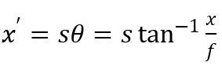 

公式(1) 

       

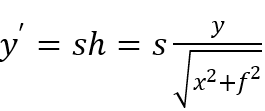 

公式(2) 
                                                              

2. **Feature detector** 

使用 Harris\_corner\_detector 

先將圖片灰階後取 Gaussian 

將 GaussianBlur 後的圖分別對 x 方向和 y 方向套用 sobal filter 得到 gradient ( Ix 和 Iy)  Ixx = Ix \* Ix   Iyy = Iy \* Iy   Ixy = Ix \* Iy 

對 Ixx  Iyy 和 Ixy 分別在取一次 Gaussian 得到每個點的 2\*2 矩陣 

依每個 2\*2 矩陣的 det/trace 得到每個點的 corner\_response 

將 每個 10 \*10 kernel 中最大的 corner\_response 的點取出當 feature point 

3. **Feature description**

使用 MSOP descripter vector 

先將每個 feature point 算出的角度將圖片以 feature point 為中心旋轉,得到每個 feature point 旋轉後的 圖,在旋轉後的圖上取 feature point 周圍 40 \* 40 的 pixel 範圍,在把每 25 個平均,最後得到 8 \* 8 的範圍 當成 oriented patch,這個 oriented patch 就是這個 feature point 的 descripter vector 

4. **Feature matching**

把每點 8 \* 8 的 descriptor vector 以距離的方式算最接近的且小於 threshold 的 match 起來 

5. **Ransac**

為了得到最好的 translate matrix 

把每個 match 到的點相扣,把拿到的位移依序套到圖一上,算出圖一位移過後每個 match 點跟圖二上的 match 點距離,如果距離小於 threshold ,那這個位移的 inliner 就加一,取 inliner 最多的位移當成是 translate matrix 

6. **Stitch 這部就是把兩張圖接起來** 

用 warpAffine 依據得到的 translate matrix 位移圖一後,得到一張圖一 shape 加上位移的大小的圖,再把 位移部分用圖二的 pixel 補上 

7. **Blend 為了消除明顯的接縫** 

使用 linear blend with constant width 把圖一,圖二重疊的部分的顏色由兩張影像加權算出 alpha 值後依 alpha 值比重得出,如下圖所示, alpha 值由算一個 y=ax+b 得到,並且取其中間線,先找出兩張影像重疊部 分的中心線,以此中線左右取個固定寬度再做 linear blending 

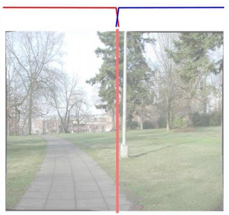

8. **End to end alignment**

因為接起來圖片有可能會一值往上或往下位移,因此要把這些位移平均,解法也是算一個 y=ax+b ,但是因 為算出來 pixel 位子有些會是小數所以強制把這些 pixel 值變整數,因此圖片放大會一格一格的(如下圖), 所以最後繳交上去的程式這段是沒使用的 

9. **Crop**

最後一步把黑邊去掉,一開始投影完的圖我們也有去除黑邊 

***INPUT*** 

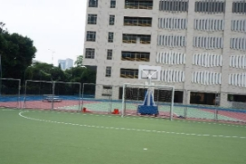 

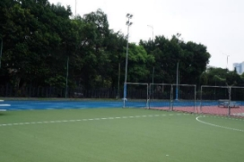 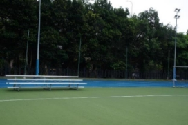

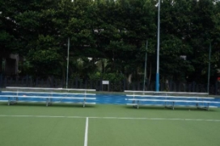 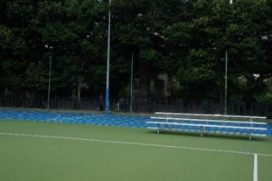

` `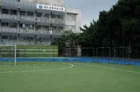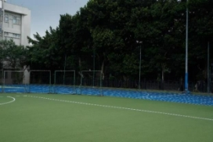

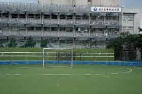

***Result :*** Projection **:** 

![ref1] ![ref1]

Feature Point **:**  

 

Feature Match **:**  

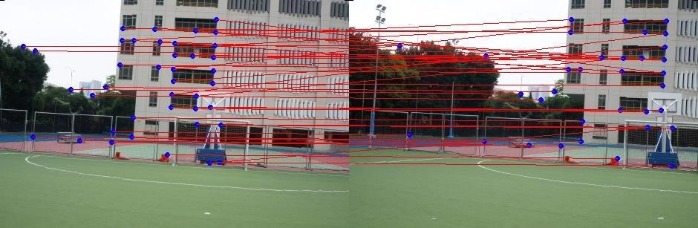

Stitch Image **:**  

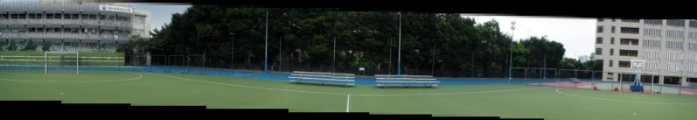

End To End Alignment Image **:**  

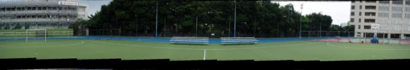

Result Image **:**  

Result Image Without End To End Alignment**:**  

[ref1]: picture/Aspose.Words.0b80bc36-e9ac-433b-9b0e-de9ffa0b8212.013.png

